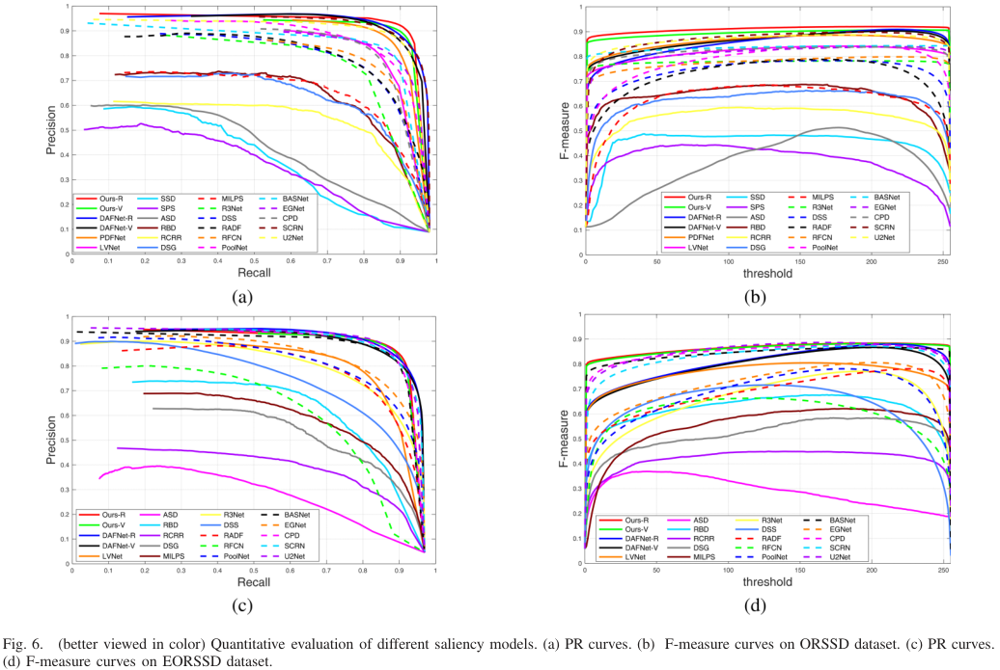

# Evaluation-Tool-MATLAB
The Code was used for evaluation in TGRS 2021 paper '[Edge-Aware Multiscale Feature Integration Network for Salient Object Detection in Optical Remote Sensing Images](https://ieeexplore.ieee.org/stampPDF/getPDF.jsp?tp=&arnumber=9474908&ref=aHR0cHM6Ly9pZWVleHBsb3JlLmllZWUub3JnL2Fic3RyYWN0L2RvY3VtZW50Lzk0NzQ5MDg=)', [Xiaofei Zhou](https://scholar.google.com.hk/citations?hl=zh-CN&user=2PUAFW8AAAAJ), [Kunye Shen](https://scholar.google.com.hk/citations?hl=zh-CN&user=q6_PkywAAAAJ), [Zhi Liu](https://scholar.google.com.hk/citations?hl=zh-CN&user=Sd5VB2cAAAAJ), [Chen Gong](https://scholar.google.com.hk/citations?user=guttoBwAAAAJ&hl=zh-CN), Jiyong Zhang, and Chenggang Yan.

## Required libraries
MATLAB R2016a

## Usage
1. Clone this repo
```
https://github.com/Kunye-Shen/Evaluation-Tool-MATLAB.git
```
2. Cd to the directory 'Compare_code', run the evaluation code by command: ```matlab main.m```.

## Implemented measures
### Precision-recall curves and F-measure curves

